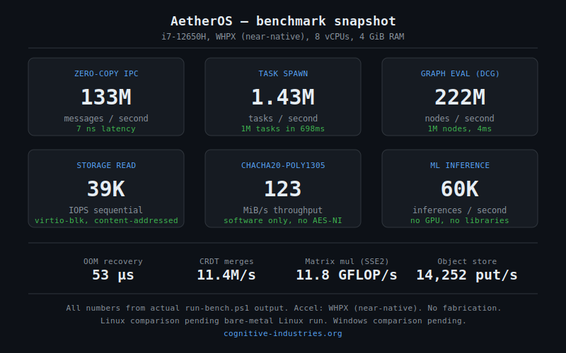
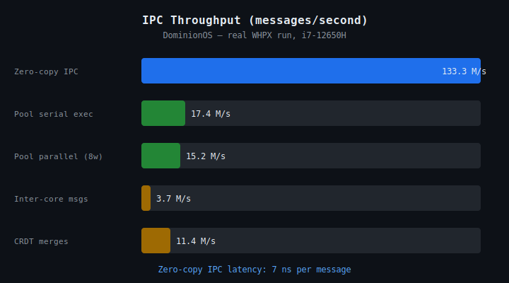
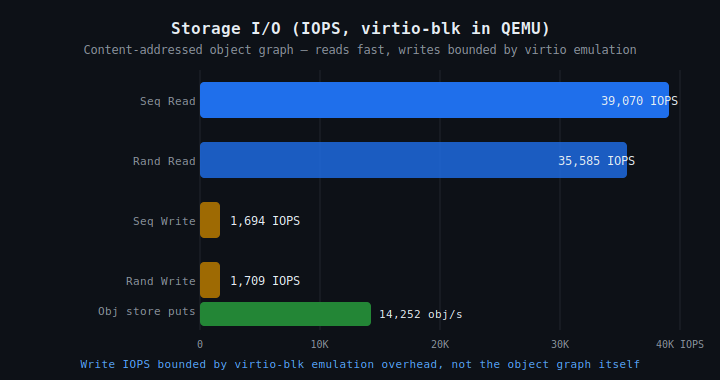
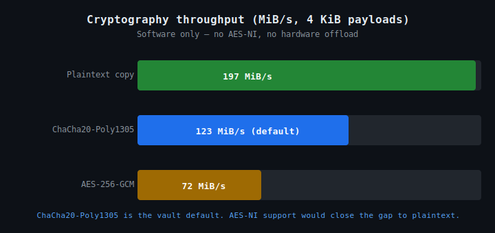
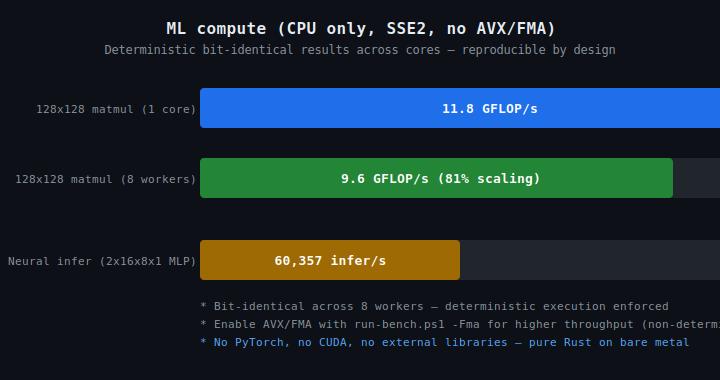

# AetherOS

> **Experimental. In development. Use at your own risk.**
> Real hardware can be bricked. QEMU or expendable bare metal only until this stabilises.

A capability-secured operating system built from scratch in Rust. We've spent about four days on it. The backend is solid. The frontend is not. We're releasing it because people asked.



---

## What this actually is

AetherOS is a research OS. Not a replacement for Linux or Windows. Not production ready. A proof of concept that answers one question: can you build a practical OS where capability-based security, deterministic execution, and content-addressed storage are first-class primitives rather than bolted-on afterthoughts?

The answer so far: yes.

The backend works. Capability enforcement, storage, cryptography, IPC, ML inference, networking — all functional. The part you'd actually interact with as a user (shell, desktop apps, hardware support) is maybe 30% done. That's the main focus going forward. We didn't release this because it's polished. We released it because the architecture is interesting and people wanted to poke at it.

**Don't expect Windows. Don't expect Linux.** Expect a research OS that boots, has real security primitives, and is missing a lot of the things you'd consider basic.

---

## The core ideas

**Capabilities.** Every operation requires an unforgeable token of authority. There's no ambient permission model — you can't escalate privilege through memory corruption because capabilities are kernel-enforced and can't be forged. This is CHERI-style capability security implemented in software.

**Content-addressed storage.** The entire system state is a SHA-256 hash tree. Everything is immutable and deduplicated. Snapshots are instant. You can roll back the whole OS like reverting a Git commit.

**Deterministic execution.** The machine is a state machine. Every action is an explicit input event. No hidden state, no timing side channels in the core model. Crash a process, rewind it, replay exactly what happened.

These aren't marketing claims. They're in the code, enforced at the kernel level, with tests that run both on the host and on the booted machine.

---

## What works

**Core system**
- Boots on x86-64, BIOS and UEFI (QEMU tested, bare metal works with caveats)
- Capability security, enforced in the kernel, with provenance tracking
- Content-addressed immutable object graph (system-wide Git)
- SMP: 8 cores tested, near-linear scaling
- Deterministic state machine with replay
- Safe-mode terminal (ASH) for low-level access

**The Aether language** runs inside the OS: lexer, parser, interpreter, capability-gated cells, parallel placement hints (`@CPU`/`@GPU`/`@NPU`), semantic primitives. The polyglot frontend accepts Python, Rust, JavaScript, TypeScript, Java, and C++ syntax and compiles it to the same AST — useful for demo-level code, not a full runtime for any of those languages.

**Security and cryptography**
- ChaCha20-Poly1305 (default vault cipher)
- AES-256-GCM
- Lamport XMSS post-quantum hybrid signatures
- Zero-plaintext encrypted vault with crypto-agility
- Capability firewall and airlock (intra/inter-domain authority)
- Deniable storage (hidden domains, coercion resistant)
- Runtime attestation with hash-chain provenance

**Storage and persistence**
- Immutable content-addressed object graph
- Instant snapshot and rollback
- VFS projection for POSIX-style file access
- Persistence to virtio-blk disk, crash recovery

**Networking**
- Named Data Networking (NDN) forwarding
- DominionLink: self-certifying IDs and Kademlia DHT
- ARP, ICMP, UDP over virtio-net
- DNS bridge (AetherLink names to DNS)
- HTTPS/TLS (basic)

**ML and compute**
- Neural network inference and training (reverse-mode autodiff)
- int8 quantization
- 11.8 GFLOP/s matrix multiply (SSE2, no AVX, no external libraries)
- 60,357 inferences/second on a 2x16x8x1 MLP
- Bit-identical results across cores by default — determinism enforced

**Desktop**
- 9 built-in apps: Desktop, Files, Browser, Terminal, Editor, IDE, Explorer, Task Manager, Settings
- Floating window manager, taskbar, system tray
- Unified 2D/3D rendering stack with software rasterizer
- Browser with HTML5 parsing, CSS cascade, JavaScript interpreter

---

## What doesn't work yet

**Frontend (main focus going forward)**
- Terminal: fully functional, limited command set
- Browser: renders HTML/CSS/JS, not all features wired
- Shell fragmentation — multiple shell implementations need consolidation
- Composable UI panels exist on the desktop, not yet extended to all app pages

**Hardware support (thin)**
- Keyboard/mouse: PS/2 only — USB HID not implemented
- Network: virtio-net only, no real NIC drivers
- Storage: virtio-blk only, no NVMe or SATA drivers
- Graphics: software framebuffer, no GPU drivers
- Audio: specified, not coded
- Wireless: not implemented

**Advanced features**
- Formal verification proofs: deferred
- Measured boot / TPM: deferred
- Multi-user: deferred
- Preemptive scheduling: currently cooperative
- Distributed multi-node deployment: single-node focus

---

## Benchmarks

These numbers come from `run-bench.ps1` running AetherOS inside QEMU with WHPX (Windows Hypervisor Platform, near-native speed). Test machine: Intel i7-12650H, 16 GB DDR5, Windows 11 host, 8 vCPUs allocated to QEMU, 4 GiB RAM.

We have not run Linux or Windows benchmarks yet on the same machine. Those comparisons will come when the Linux bench harness (`bench/linux/run-linux-bench.sh`) is complete.









### Numbers at a glance

| Subsystem | Metric | Result |
|---|---|---|
| IPC | Throughput | 133,266,744 msgs/s |
| IPC | Latency | 7 ns per message |
| Tasks | Spawn rate | 1,430,747 tasks/s |
| Tasks | Dispatch (O(n)) | 51,520 tasks/s |
| Graph eval | DCG linear | 222,070,090 nodes/s |
| Storage | Sequential read | 39,070 IOPS |
| Storage | Sequential write | 1,694 IOPS |
| Storage | Object puts | 14,252 obj/s |
| Crypto | ChaCha20-Poly1305 | 123 MiB/s |
| Crypto | AES-256-GCM | 72 MiB/s |
| ML | 128x128 matmul (1 core) | 11.8 GFLOP/s |
| ML | Inference (MLP) | 60,357 infer/s |
| ML | Multi-core scaling (8w) | 81% (9.6 GFLOP/s) |
| Memory | OOM recovery | 53 µs |
| CRDT | Merge rate | 11,391,218 merges/s |

Storage write IOPS are bounded by virtio-blk emulation overhead, not the object graph. Read is fast because content-addressed hashes let the system skip re-reads of unchanged data.

Crypto is software-only — no AES-NI, no hardware offload. AES-NI support would close the gap substantially. ChaCha20-Poly1305 is the default because it's faster in software and post-quantum resilient.

ML runs on CPU only, SSE2, bit-identical across cores. Enable AVX/FMA with `.\run-bench.ps1 -Fma` for higher throughput at the cost of bit-for-bit reproducibility.

---

## Hardware

### Tested configuration

- CPU: Intel Core i7-12650H (10 cores / 16 threads)
- RAM: 16 GB DDR5
- Storage: 1 TB Micron NVMe SSD (accessed via virtio-blk in QEMU)
- GPU: NVIDIA RTX 4060 Laptop + Intel UHD Graphics (neither used — software rendering only)
- Host: Windows 11, QEMU 8.x with WHPX acceleration

### In QEMU (what we actually test)

- x86-64, BIOS boot
- virtio-blk (disk), virtio-net (network)
- PS/2 keyboard and mouse
- Software framebuffer (SVGA)

### Known limitations

- Keyboard and mouse: PS/2 only. USB HID not implemented. Many modern keyboards won't work on bare metal.
- Network: virtio-net only. Real NICs are not supported yet.
- Storage: virtio-blk only. NVMe, SATA, USB mass storage — not yet.
- Graphics: software framebuffer. No GPU acceleration.
- Wireless: none.
- Audio: none.
- Real hardware: boots and runs on x86-64 bare metal, but hardware support is thin. Treat it as experimental.

**Bottom line for hardware:** QEMU is the safe path. Bare metal on an older x86 machine with PS/2 ports and no NVMe might work. Modern gaming PCs will mostly boot and then sit there.

---

## Build and run

**Requirements**
- Rust nightly (the kernel needs `no_std` + `x86_64-dominion` target)
- QEMU for testing

**Build the kernel**
```powershell
cd kernel
cargo build --release
```

**Create bootable disk image**
```powershell
cd ..\boot
cargo run --release -- ..\kernel\target\x86_64-dominion\release\dominion-kernel ..\aetheros.img
```

**Run in QEMU**
```powershell
.\run.ps1
```

**Run benchmarks**
```powershell
.\run-bench.ps1
# Results written to bench-results.json
```

**Run with AVX/FMA (non-deterministic, faster ML)**
```powershell
.\run-bench.ps1 -Fma
```

**Safe mode (text-only, no desktop)**

Build with `--features safe_mode`. Good for bare metal where the desktop doesn't come up.

---

## The terminal

The terminal is fully functional. The command set is limited — it's not bash, it doesn't have a package manager, and most Unix commands don't exist. What's there: `help`, `list`, `world`, `time`, `ml`, `caps`, `obj`, `state`, `run`, `dominion`, `selftest`, `shutdown`, and a few others. More commands are coming. The input pipeline is wired. Type, press enter, things happen.

---

## Feature matrix

Full list in `FEATURES.md`. Short version:

| Area | Status |
|---|---|
| Capability security | Implemented |
| Content-addressed storage | Implemented |
| Deterministic execution | Implemented |
| Aether language | Implemented |
| ML inference + training | Implemented |
| NDN networking | Implemented |
| DominionLink DHT | Implemented |
| Desktop (9 apps) | Partial (30%) |
| Hardware drivers | Partial (virtio + PS/2 only) |
| Browser | Partial |
| Formal verification | Deferred |
| Multi-user | Deferred |
| GPU acceleration | Deferred |
| ARM64 / RISC-V | Deferred |

---

## Architecture

The architecture documentation lives in `docs/architecture.md` (17 subsystems, machine-readable manifest in `docs/subsystem-manifest.json`). Short version:

- **Bootloader** (~50 KB): BIOS to 64-bit mode, hands off to kernel
- **Kernel** (~100 KB): scheduling, memory, IPC, capability enforcement
- **dominion-core** (~400 KB): filesystem, networking, crypto, ML, device drivers, browser, desktop
- **Aether runtime**: interpreter, DCG compiler, polyglot frontend

The kernel is small. The core library is large. That's intentional — most OS logic lives in the core, where it can be tested on the host without booting.

---

## Infrastructure we need to set up

AetherOS has the code for a distributed network (DominionLink), a package repository, and a compute pool. None of it is deployed yet. The full setup guide is in `INFRASTRUCTURE.md`. Short version of what's needed:

**AetherLink bootstrap nodes** (3-5 for redundancy): 2 vCPU, 4 GB RAM, 100 GB SSD each. Listen on UDP 5000 (DHT). Geographic spread helps.

**Package repository**: 1 server, 1 TB storage, PostgreSQL for metadata, HTTP API. TCP port 6000.

**Compute pool coordinator**: lightweight, TCP port 7000.

**Estimated monthly cost**: $50-100 for Phase 1. Domain registration (aether.link or similar) on top.

See `INFRASTRUCTURE.md` for exact setup steps, config file formats, and security considerations.

---

## Contributing

We want contributors. Rules are in `CONTRIBUTING.md`. Key points:

- If using AI assistance, it must be Claude Opus 4.8. Other models produce lower quality output for systems code and break the workflow.
- One thing per PR. If it touches the kernel and the shell, split it.
- Must compile, pass all existing tests, no benchmark regressions.
- Read the spec before touching the code — `docs/architecture.md` and the subsystem docs are the source of truth.
- For major features: open an issue first. For small fixes: PR is fine.

See `AI_DEVELOPMENT_GUIDELINES.md` for the spec-first workflow.

---

## Spec-first development (for AI agents)

Full guide in `docs/AI_AGENT_GUIDE.md`. One-paragraph version:

Before any major feature addition, research the subsystem in `docs/architecture.md`, then update or add the relevant spec in `docs/`, then write the code against the spec with tests and benchmarks. For minor changes, update the spec and add a test. SPECs are ground truth. Code serves the spec, not the other way around. If the spec is wrong, fix the spec first, then fix the code.

---

## License

Dual licensed. Details in `LICENSE.md`.

- Non-commercial (individuals, research, education): AGPLv3. Free, full source, share improvements.
- Commercial (corporations): paid license required. Contact us.

Attribution is always required:
```
AetherOS, developed by Cognitive Industries (https://cognitive-industries.org)
```

---

## Development status and roadmap

We built this in about four days. Sparse updates are likely unless there's real interest, contributors show up, or something specific needs more attention. We're not abandoning it, but we're also not treating it as a full-time project unless something changes.

**What's coming (in rough priority order)**
1. Wire up the frontend — terminal command set, shell consolidation, GUI wiring
2. More hardware drivers — real NIC support, NVMe
3. Formal verification proofs for the security model
4. Public AetherLink bootstrap nodes
5. Package repository
6. Preemptive scheduling
7. Multi-user support
8. GPU acceleration (far out)
9. ARM64 / RISC-V (far out)

---

## Contact and links

- Website: [cognitive-industries.org](https://cognitive-industries.org)
- Email: [contact@cognitive-industries.org](mailto:contact@cognitive-industries.org) (licensing, custom development, support)
- Architecture: `docs/architecture.md`
- Subsystem map: `docs/subsystem-manifest.json`
- Feature matrix: `FEATURES.md`
- Build guide: `DEVELOPMENT.md`
- Hardware compatibility: `HARDWARE.md`
- Infrastructure setup: `INFRASTRUCTURE.md`
- Contributing: `CONTRIBUTING.md`

---

*AetherOS is a Cognitive Industries research project. ~4 days of work. Real security model. Incomplete frontend. Released because people asked.*
